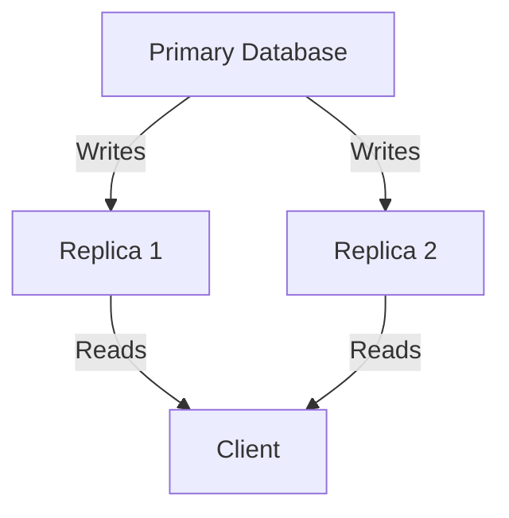

# Day 4: Database Replication (

Day 4: Database Replication

## Explanation

Database replication is the process of copying and maintaining database objects, such as data, from one database (the primary) to one or more other databases (the replicas). Replication supports high availability, disaster recovery, load distribution for read-heavy workloads, and near-real-time analytics. Key concepts include replication topology, consistency models, latency, and failover capability.

- Topologies:
    - Master-slave (primary-replica)
    - Master-master (multi-master)
    - Peer-to-peer
    - Cascading replication
- Consistency models:
    - Asynchronous replication: replicas may lag behind the primary
    - Semi-synchronous replication: some confirmation before commit
    - Synchronous replication: commits wait until replicas acknowledge
- Latency vs. throughput trade-offs: tighter consistency often increases write latency on the primary
- Failover: automatic or manual switching to a replica in case of primary failure


## Mermaid Diagram




## Django Integration Example

- Use a database router to direct read queries to replicas and write queries to the primary.
- Configure multiple databases in settings, then implement a router that routes accordingly.
- Ensure proper transaction handling and failover awareness.

```python
# settings.py
DATABASES = {
    'default': {
        'ENGINE': 'django.db.backends.postgresql',
        'NAME': 'app_db',
        'USER': 'dbuser',
        'PASSWORD': 'secret',
        'HOST': 'primary-db.example.com',
        'PORT': '5432',
    },
    'replica1': {
        'ENGINE': 'django.db.backends.postgresql',
        'NAME': 'app_db',
        'USER': 'dbuser',
        'PASSWORD': 'secret',
        'HOST': 'replica1-db.example.com',
        'PORT': '5432',
    },
    'replica2': {
        'ENGINE': 'django.db.backends.postgresql',
        'NAME': 'app_db',
        'USER': 'dbuser',
        'PASSWORD': 'secret',
        'HOST': 'replica2-db.example.com',
        'PORT': '5432',
    },
}

# routers.py
class PrimaryReplicaRouter:
    def db_for_read(self, model, **hints):
        # Simple round-robin or random selection can be used
        import random
        return random.choice(['replica1', 'replica2'])
    def db_for_write(self, model, **hints):
        return 'default'
    def allow_relation(self, obj1, obj2, **hints):
        return True
    def allow_migrate(self, db, app_label, model_name=None, **hints):
        return db == 'default'
```

- Deploy the primary and replicas with a robust replication setup in your database system (e.g., PostgreSQL streaming replication, MySQL replication).
- Monitor replication lag, error rates, and automated failover readiness.


## Learning Objectives

- Explain what database replication is and why it’s used .
- Differentiate among common replication topologies (master-slave, multi-master, cascading) .
- Implement a read-write split strategy in a Django application using database routers .
- Describe latency, consistency, and failover considerations in replicated setups .


## Real-World Use Case

A social media platform maintains a primary database for all writes and uses two read replicas to serve feed and profile queries. This setup reduces read latency during peak hours and provides a disaster-recovery path if the primary becomes unavailable. Regular monitoring ensures that replication lag stays within acceptable bounds and automated failover can promote a replica to primary if needed.

## Quiz

1. What is the primary benefit of database replication?
2. Name two replication topologies and a brief characteristic of each.
3. In a Django project, how can you route reads to replicas while writes go to the primary?
4. What is a common sign that replication lag is becoming problematic?

---
