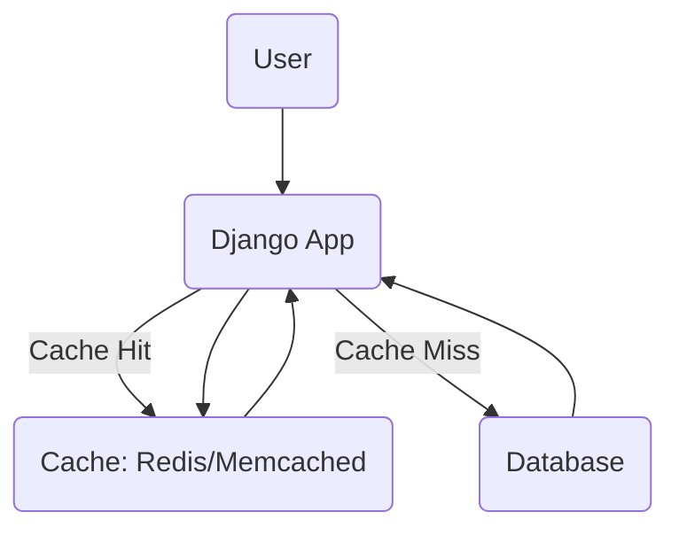

## Lesson: Introduction to Caching in System Design


***

### Learning Objectives

- Understand what caching is and why it is used in system design.
- Visualize simple caching architecture within a web application.
- Learn how to integrate caching with Django using its built-in framework.
- Recognize real-world scenarios where caching greatly improves performance.
- Test your understanding with a brief quiz.

***

### What is Caching?

**Caching** is the process of storing copies of frequently accessed data in a fast-access storage layer (cache), so repeated reads are quicker and do not hit slower backend services like databases. Caching can drastically improve system performance, reduce latency, and decrease server load.

**Common uses for caching:**

- Storing results of expensive database queries.
- Caching rendered web pages or API responses.
- Reducing calls to external APIs.

**Types of caches:**

- In-memory (e.g., Redis, Memcached)
- Local (per-process, such as Python’s `lru_cache`)
- Distributed (shared across servers)

***

### Caching Architecture (Mermaid Diagram)




***

### Django Integration Example

Django provides a cache framework that supports various backends like Memcached and Redis.

#### Example: Using Redis as a Cache Backend

1. **Install Redis and django-redis:**

```
pip install django-redis
```

2. **Set up your cache in `settings.py`:**

```python
CACHES = {
    "default": {
        "BACKEND": "django_redis.cache.RedisCache",
        "LOCATION": "redis://127.0.0.1:6379/1",
        "OPTIONS": {
            "CLIENT_CLASS": "django_redis.client.DefaultClient",
        }
    }
}
```

3. **Using the cache in your Django views:**

```python
from django.core.cache import cache

def get_data():
    data = cache.get('my_key')
    if data is None:
        data = slow_database_query()
        cache.set('my_key', data, timeout=300)
    return data
```

4. **Cache a whole view using a decorator:**

```python
from django.views.decorators.cache import cache_page

@cache_page(60 * 15)
def my_view(request):
    # Your processing here
    pass
```


***

### Real-World Use Case

**News or Blog Platform:**
A news website caches the latest homepage articles for a short period (e.g., 1-5 minutes). During traffic spikes, most users are served the cached version, keeping database load low and page load times fast.

***

### Quick Quiz

1. **What is the main benefit of using a cache in web applications?**
2. **Name two popular tools used as distributed caches.**
3. **What happens when a cache "miss" occurs?**
4. **How can you cache an entire view in Django?**

***

**End of Lesson**

