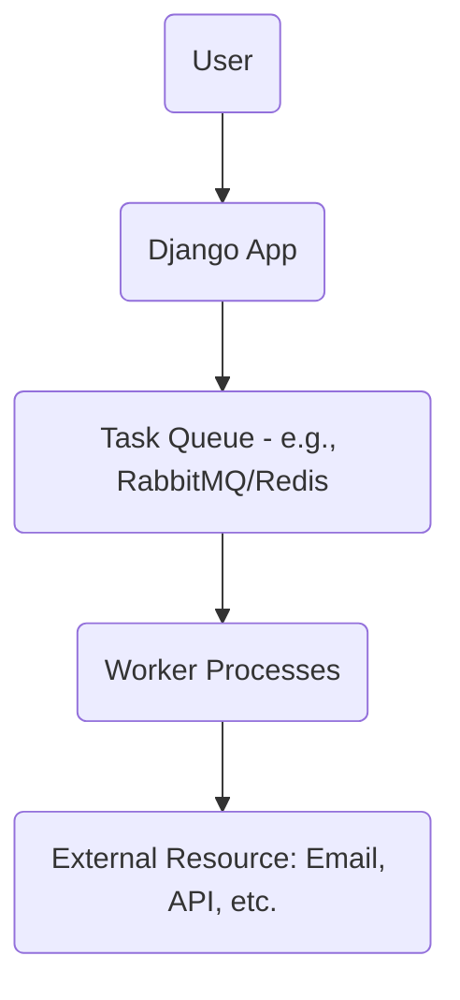

## Lesson: Task Queues in System Design


***

### Learning Objectives

- Explain the concept and advantages of task queues in modern systems.
- Visualize how task queues enable asynchronous processing.
- Demonstrate how to integrate task queues with Django using Celery.
- Understand a real-world application of task queues.
- Reinforce understanding with a brief quiz.

***

### What is a Task Queue?

A **task queue** is a system component that enables you to offload work—such as sending emails, processing images, or running computations—from your main application by placing those jobs in a queue. Workers then process these tasks asynchronously, improving the responsiveness and scalability of your system.

**Key benefits:**

- Frees up the main web server to respond quickly to users.
- Allows work to be retried if it fails.
- Enables horizontal scaling by adding workers.
- Decouples request handling from background processing.

***

### Task Queue Architecture (Mermaid Diagram)




***

### Django Integration Example with Fix

Integrate task queues in Django using the popular library [Celery](https://docs.celeryproject.org/en/stable/).

#### Basic Steps:

1. **Install Celery and a message broker (like Redis):**

```
pip install celery redis
```

2. **Configure Celery in your Django project (`project/celery.py`):**

```python
import os
from celery import Celery

os.environ.setdefault("DJANGO_SETTINGS_MODULE", "project.settings")
app = Celery("project")
app.config_from_object("django.conf:settings", namespace="CELERY")
app.autodiscover_tasks()
```

3. **Add Celery settings to `project/settings.py`:**

```python
CELERY_BROKER_URL = "redis://localhost:6379/0"
CELERY_RESULT_BACKEND = "redis://localhost:6379/0"
```

4. **Define a task (`yourapp/tasks.py`):**

```python
from celery import shared_task

@shared_task
def send_welcome_email(user_id):
    # Send email logic here
    pass
```

5. **Call the task from your code:**

```python
from yourapp.tasks import send_welcome_email

send_welcome_email.delay(new_user.id)
```

6. **Run the Celery worker:**

```
celery -A project worker -l info
```


#### Common Celery Fixes for Django

- **Timezone warnings:** Set `CELERY_TIMEZONE = "UTC"` in your Django settings.
- **Task discovery issues:** Ensure each app has an `__init__.py` and tasks are loaded in `app.autodiscover_tasks()`.

***

### Real-World Use Case

**Social Media Platform:**
When a user uploads a profile picture, the Django app quickly puts a "process image" task on the queue. Worker servers crop, resize, and store the image in the background, freeing up the web server for more user requests and providing a smoother experience.

***

### Quick Quiz

1. **What is the main reason to use a task queue in your system?**
2. **Name two common message brokers for task queues.**
3. **How do you call a Celery task asynchronously from Django?**
4. **What should you check if Celery tasks aren't being discovered in Django?**

***

**End of Lesson**

