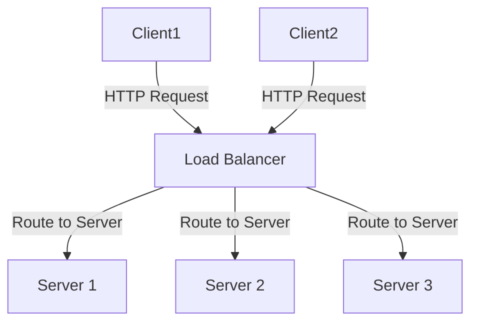

# System Design Lesson: Load Balancing

## Learning Objectives

- Understand the concept and importance of load balancing in system design.
- Visualize how load balancing distributes traffic among backend servers.
- Learn how to integrate a load balancer pattern in a Django application.
- See real-world applications of load balancing.
- Test understanding with a brief quiz.

***

## What is Load Balancing?

Load balancing is a system design pattern that distributes incoming network traffic across multiple servers to ensure reliability and efficiency. This mechanism prevents a single server from becoming a bottleneck, offers fault tolerance, and improves scalability by balancing the load among several backend resources.

There are various types of load balancers:

- Hardware load balancers: Specialized devices.
- Software load balancers: Applications like NGINX or HAProxy.
- DNS-based load balancers: Distribute traffic at the domain level.

***

## Visualization

Below is a Mermaid diagram illustrating a simple load balancer setup:




***

## Django Framework Integration Example

To use load balancing with a Django application, you typically deploy your Django app on multiple servers and place a load balancer in front of them. Here’s a simple configuration using NGINX as the load balancer:

**NGINX config (load_balancer.conf):**

```nginx
upstream django_servers {
    server 192.168.1.2:8000;
    server 192.168.1.3:8000;
    server 192.168.1.4:8000;
}

server {
    listen 80;
    server_name example.com;

    location / {
        proxy_pass http://django_servers;
    }
}
```

This configuration proxies requests to three Django server instances running at different IP addresses.

***

## Real-World Example

A common use case for load balancing is a high-traffic e-commerce website like Amazon. When a user browses products or places orders, their requests are routed through a load balancer, which distributes them among many backend servers. This ensures the website remains responsive and available, even under heavy load.

***

## Quiz

1. What is the main purpose of a load balancer in system design?
2. Name two types of load balancers.
3. How does load balancing improve fault tolerance?
4. How do you integrate Django with a load balancer like NGINX?
5. Give a real-world example where load balancing is essential.

***

## References

Load balancing explained and integration (https://www.nginx.com/resources/glossary/load-balancing/)
Real-world load balancing example (https://www.cloudflare.com/learning/cdn/glossary/load-balancing/)

***

Feel free to copy this lesson into your GitHub Markdown editor!

