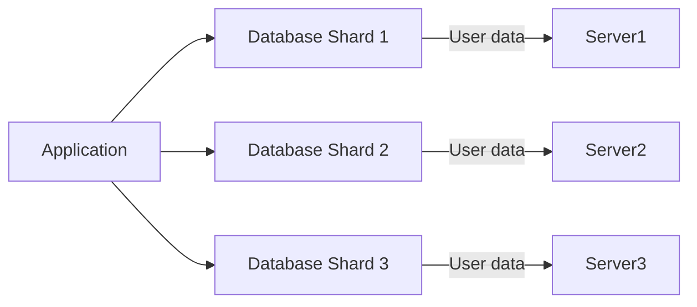

# add this link in ti [https://1akshayyyyyyyy.github.io/Day-5---Database-Sharding/](https://1akshayyyyyyyy.github.io/Day-5---Database-Sharding/)

Here is the updated Day 5 lesson on Database Sharding in Markdown format with the requested link included at the end for easy reference:

***

# Day 5: Database Sharding


***

## Learning Objectives

- Understand what database sharding is and why it is used.
- Visualize sharding architecture using a diagram.
- Learn how to implement sharding with Django.
- Recognize real-world scenarios where sharding is beneficial.
- Test understanding with a quiz.

***

## 1. Explanation

**Database sharding** is a horizontal partitioning technique where large databases are divided into smaller, more manageable pieces called *shards*. Each shard holds a subset of the data, and these shards are distributed across multiple servers.

**Why use sharding?**

- To improve scalability by distributing data load.
- To enhance performance by reducing query sizes.
- To alleviate the bottleneck of a single database server.

**Key Concept:**

- Sharding involves splitting data based on a shard key (like user ID or region).
- Each shard acts as an independent database, and applications route queries based on the shard key.

***

## 2. Architecture Visualization (Mermaid)



*Each shard contains a subset of data—here, for example, user data partitioned by user ID ranges.*

***

## 3. Django Integration Example

**Scenario:** Implement application-level routing in Django based on user ID for sharding.

**Step 1: Define a simple shard routing function**

```python
def get_shard_for_user(user_id):
    if user_id < 10000:
        return 'shard1'
    elif user_id < 20000:
        return 'shard2'
    else:
        return 'shard3'
```

**Step 2: Database configuration in `settings.py`**

```python
DATABASES = {
    'default': {},
    'shard1': {
        'ENGINE': 'django.db.backends.postgresql',
        'NAME': 'shard1_db',
        # other connection params
    },
    'shard2': {
        'ENGINE': 'django.db.backends.postgresql',
        'NAME': 'shard2_db',
        # other connection params
    },
    'shard3': {
        'ENGINE': 'django.db.backends.postgresql',
        'NAME': 'shard3_db',
        # other connection params
    },
}
```

**Step 3: Routing queries based on user ID**

```python
from django.db import connections

def get_user_queryset(user_id):
    shard = get_shard_for_user(user_id)
    return connections[shard].cursor()
```

This enables dynamic connection routing based on the shard key during runtime.

***

## 4. Real-World Use Case

A global social media platform with billions of users uses sharding to split user data by geographical regions (e.g., regions, countries). This setup reduces latency and distributes load, ensuring smooth performance even during viral events.

***

## 5. Quiz

1. **What is the main advantage of database sharding?**
2. **Identify a common shard key used in e-commerce platforms.**
3. **In Django, how does application routing decide which shard to query?**

***

**Answers:**

1. It enhances scalability and performance by distributing data across multiple servers.
2. User ID, region, or country are common shard keys.
3. It routes queries dynamically based on the shard key (like user ID) through custom logic.

***

For more details, visit the lesson online:
[Day 5 - Database Sharding](https://1akshayyyyyyyy.github.io/Day-5---Database-Sharding/)

***

*This lesson is now ready to be used or shared as needed.*

