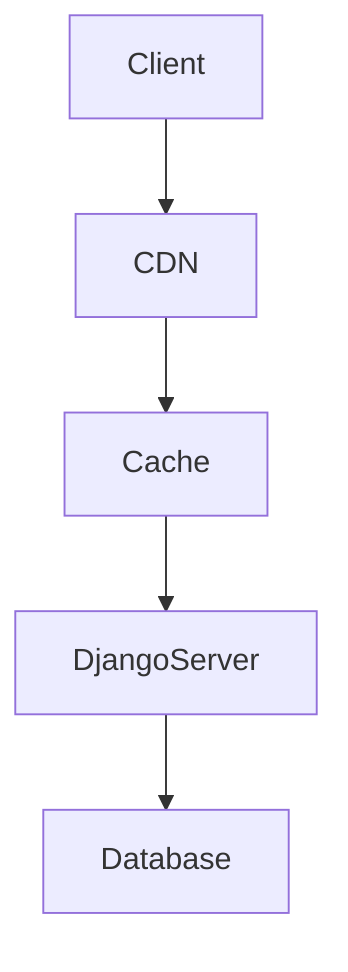

# Day 6: Caching & Content Delivery Networks (CDN)

## Learning Objectives
- Understand caching mechanisms and their benefits.
- Learn the role and structure of Content Delivery Networks (CDNs).
- Visualize system interactions using a Mermaid diagram.
- Integrate caching and CDN strategies in Django projects.
- Identify real-world use cases for caching and CDNs.

## Explanation
Caching is a technique that stores frequently accessed data in a temporary location (cache) to allow faster access and reduce load on the backend. Common cache types include memory (RAM), disk, or distributed caches (e.g., Redis). Content Delivery Networks (CDNs) are globally distributed networks of servers that cache and deliver content (like images, videos, and static files) to users from the location closest to them, reducing latency and speeding up load times.

## Mermaid Diagram


## Integration with Django
In Django, caching can be accomplished using frameworks like Redis, Memcached, or the built-in local-memory cache. Static files (images, CSS, JavaScript) can be served through a CDN using libraries like django-storages for integration with providers (e.g., AWS CloudFront).

Example Django cache configuration (settings.py):
```python
CACHES = {
    'default': {
        'BACKEND': 'django.core.cache.backends.memcached.MemcachedCache',
        'LOCATION': '127.0.0.1:11211',
    }
}
```
Example static file CDN configuration:
```python
AWS_S3_CUSTOM_DOMAIN = '<your_cloudfront_url>'
STATIC_URL = 'https://%s/static/' % AWS_S3_CUSTOM_DOMAIN
```

## Real-World Use Case
E-commerce sites like Amazon use CDNs to serve product images and cache search results for rapid access. News websites leverage caching and CDNs to instantly show breaking news content to global audiences.

## Quiz
1. What is the main purpose of caching?
2. How does a CDN improve user experience?
3. Name one caching backend supported by Django.
4. Give an example of a real-world use case where a CDN is critical.
