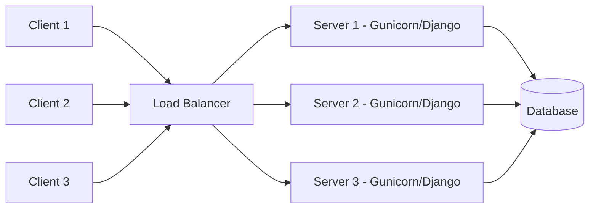

Let’s do that properly.
Here’s **Day 1 — Load Balancing** again, **pure markdown**, no extra chat formatting, fully copy-pasteable into GitHub or VS Code markdown editor 👇

---

# 🧠 System Design — Day 1: Load Balancing

> **Topic:** Load Balancing  
> **Focus:** Distributing traffic efficiently across multiple servers  
> **Framework Example:** Django + Gunicorn + Nginx  
> **Visualization:** Mermaid Diagram  

---

## 🎯 Learning Objectives

- Understand what **load balancing** is and why it’s essential in scalable systems.  
- Learn common **load balancing algorithms** and their differences.  
- Visualize how traffic flows between clients, load balancers, and backend servers.  
- See how load balancing is implemented in a **Django web application** setup.  

---

## 🧩 Concept Overview

**Load Balancing** is the process of distributing incoming network traffic across multiple servers to ensure reliability, scalability, and high availability.

When your application experiences high traffic (e.g., during a sale or event), a single server can become a bottleneck.  
A **load balancer** helps by spreading requests across multiple backend servers, ensuring no single server is overwhelmed.

---

## 🔍 Common Load Balancing Algorithms

| Algorithm | Description | Use Case |
|------------|--------------|-----------|
| **Round Robin** | Distributes requests sequentially across servers. | Simple, fair distribution when all servers are similar. |
| **Least Connections** | Sends traffic to the server with the fewest active connections. | Ideal when servers have different capacities or workloads. |
| **IP Hash** | Uses the client’s IP address to always route them to the same server. | Used for sticky sessions or caching consistency. |

---

## 🖼️ Visualization (Mermaid Diagram)




````

**Explanation:**

* Clients send requests to the Load Balancer (e.g., **Nginx**, **HAProxy**, or **AWS ELB**).
* The Load Balancer distributes requests to backend **Django application servers** (Gunicorn workers).
* All servers connect to a shared **database** and/or cache.

---

## ⚙️ Django Framework Integration Example

Here’s how load balancing typically works in a **Django production setup**:

### 🧱 Architecture

```
Client → Nginx (Load Balancer) → Gunicorn (Django App Servers) → PostgreSQL / Redis
```

### 🔧 Nginx Configuration Snippet

```nginx
upstream django_servers {
    server 127.0.0.1:8001;
    server 127.0.0.1:8002;
    server 127.0.0.1:8003;
}

server {
    listen 80;
    server_name mydjangoapp.com;

    location / {
        proxy_pass http://django_servers;
        proxy_set_header Host $host;
        proxy_set_header X-Real-IP $remote_addr;
    }
}
```

**Explanation:**

* `upstream` defines multiple Django servers (running Gunicorn).
* Nginx distributes requests using a **round-robin** strategy by default.
* If one server goes down, Nginx automatically bypasses it, keeping the app live.

---

## 🌍 Real-World Example

During a **Black Friday sale**, an e-commerce platform built with Django receives thousands of concurrent users.

* The **load balancer (Nginx/AWS ELB)** spreads the traffic across multiple Gunicorn servers.
* If one instance crashes, others continue handling traffic.
* The result: minimal downtime, faster response times, and happy customers.

---

## 🧠 Quick Recap

* Load balancing prevents downtime and improves scalability.
* It can be **software-based (Nginx, HAProxy)** or **hardware-based (F5, Citrix)**.
* Works seamlessly with Django’s multi-worker setup via Gunicorn or uWSGI.
* Critical for modern microservices and cloud deployments.

---

## 🧩 Mini Quiz

1️⃣ What does the load balancer do when one server goes down?

> It stops sending traffic to that server and reroutes requests to healthy servers.

2️⃣ Which algorithm keeps the same client connected to the same server?

> **IP Hash**

3️⃣ Which Django tool is typically used with a load balancer for production?

> **Gunicorn** or **uWSGI**

---

## 🚀 Next Lesson (Day 2 Preview)

> **Topic:** Caching & CDNs
> **Goal:** Understand how caching layers and CDNs improve performance and reduce load on backend servers.
> Includes: Mermaid diagram, Redis caching example with Django.

---

📄 **File name:**
`day-01-load-balancing.md`

```

---

Would you like me to make this downloadable as `day-01-load-balancing.md` right now so you can save it directly to your system (for your GitHub repo)?
```
